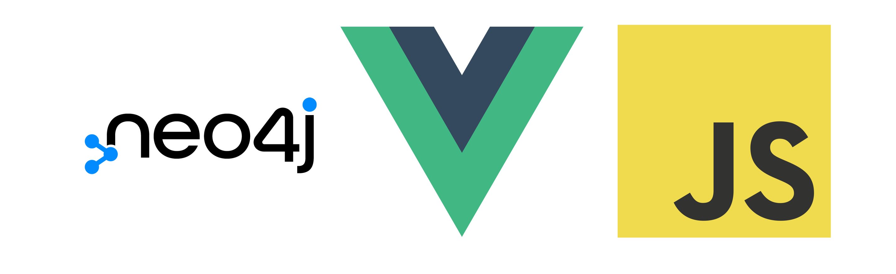

-- Projet Collaborative Developer Experience --
------

Modules à installer :
  - sync-request
  - neo4j-driver
  - node-fetch

Ils sont tous spécifiés dans le JSON 'package'
pour les installer automatiquement il faut rentrer la commande suivante:
`npm install` ou `npm i`

Technologies
--
**Neo4j** est une base de donnée de type graphe utile pour répresenter des relations et faire des recommendation.

**Vue3** est une framework javascript qui permet d'organiser les composants visuels et les données pour une maintenance plus aisée du code.

**Javascript** permettra de scripter les communications avec les serveurs.

