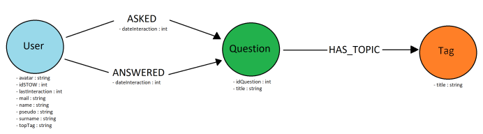

# Requêtes Neo4J

>Contient les requêtes pour créer les noeuds et les relations. Notre base de donnée est construite sous cette forme : 

**Avec les noeuds suivants :**

> ### User :
>- avatar : string
>- idStow : int
>- LastInteraction : int
>- mail : string
>- name : string
>- pseudo : string
>- surname : string
>- topTag : string

> ### Question :
>- idQuestion : int
>- title : string

> ### Tag :
>- title : string

**Avec les relations suivantes :**

> ### User - Asked -> Question :
>- dateInteraction : int

> ### User - Answered -> Question :
>- dateInteraction : int

> ### Question - Has_Topic -> Tag